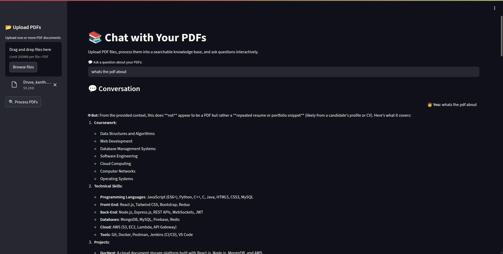

# 📚 Chat With Your PDFs

An interactive **AI-powered chatbot** that lets you upload one or more PDF files, process them into a searchable vector database, and ask questions about their content in natural language.  
Built with **Streamlit**, **LangChain**, **HuggingFace embeddings**, and **ChromaDB**.

---

## 🚀 Features

- 📂 **Upload multiple PDFs** at once.
- 🔍 **Automatic text extraction** from PDF pages.
- ✂ **Chunking** of large text for better search.
- 🧠 **Vector embeddings** using HuggingFace BGE embeddings.
- 📦 **ChromaDB** for fast semantic search.
- 💬 **Conversational chat** with memory of previous messages.
- ⚡ **Streamlit UI** for an easy-to-use interface.

---

## 📸 Demo Screenshot

> 


---

## 🛠️ Installation

### 1️⃣ Clone the repository
```bash
git clone https://github.com/p2llo/pdf-chatbot.git
cd pdf-chatbot
```

### 2️⃣ Create a virtual environment & activate it
```bash
python -m venv venv
# On Windows
venv\Scripts\activate
# On Mac/Linux
source venv/bin/activate
```

### 3️⃣ Install dependencies
```bash
pip install -r requirements.txt
```

---

## 📦 Requirements

Your `requirements.txt` should include:
```
streamlit
PyPDF2
langchain
chromadb
sentence-transformers
huggingface-hub
```

---

## ▶️ Usage

Run the app with:
```bash
streamlit run app.py
```

1. Open your browser at the link shown in the terminal (usually http://localhost:8501).
2. Upload one or more PDFs from the sidebar.
3. Click **Process PDFs**.
4. Ask any question in the main chat box and get instant answers.

---

## 📂 Project Structure

```
chat-with-your-pdfs/
│── app.py               # Main Streamlit app
│── requirements.txt     # Python dependencies
│── README.md            # Project documentation
```

---

## ⚡ Tech Stack

- **Frontend & UI**: [Streamlit](https://streamlit.io/)
- **Text Extraction**: [PyPDF2](https://pypi.org/project/PyPDF2/)
- **Vector Database**: [ChromaDB](https://www.trychroma.com/)
- **Embeddings**: [HuggingFace BGE](https://huggingface.co/)
- **LLM & Chat**: [LangChain](https://www.langchain.com/)

---


## 💡 Future Improvements

- 🌈 Modern chat bubble UI for better conversation experience.
- 📊 Display relevant document snippets with answers.
- 🌍 Deployment on Streamlit Cloud or HuggingFace Spaces.
- 📁 Support for DOCX and TXT files.

---

### 🤝 Contributing

Contributions are welcome! Please fork the repo and submit a pull request.

---

**Made with ❤️ using Streamlit & LangChain**
